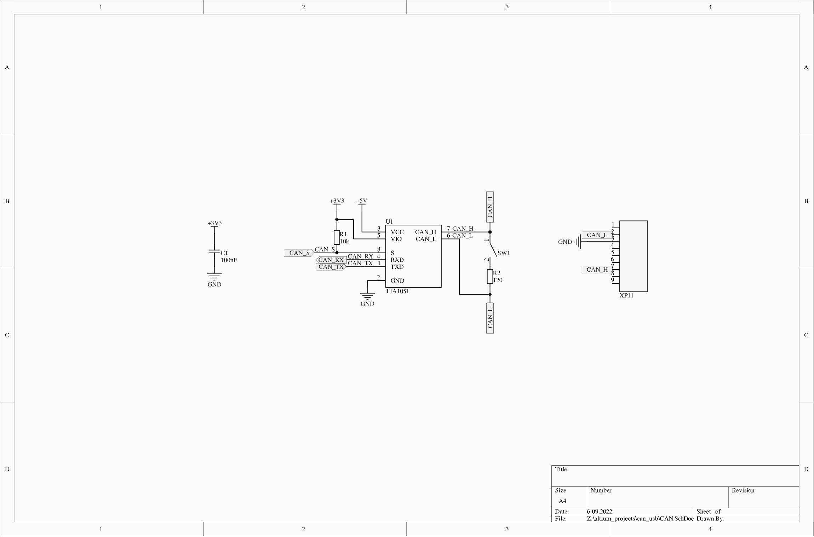
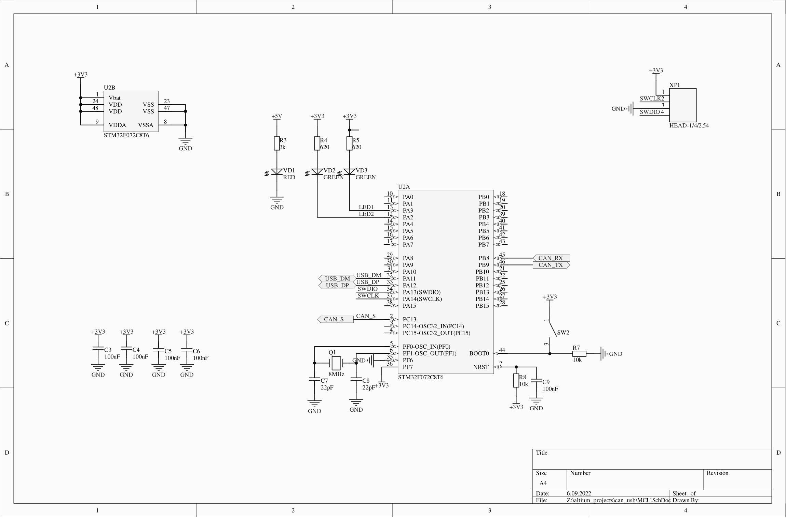
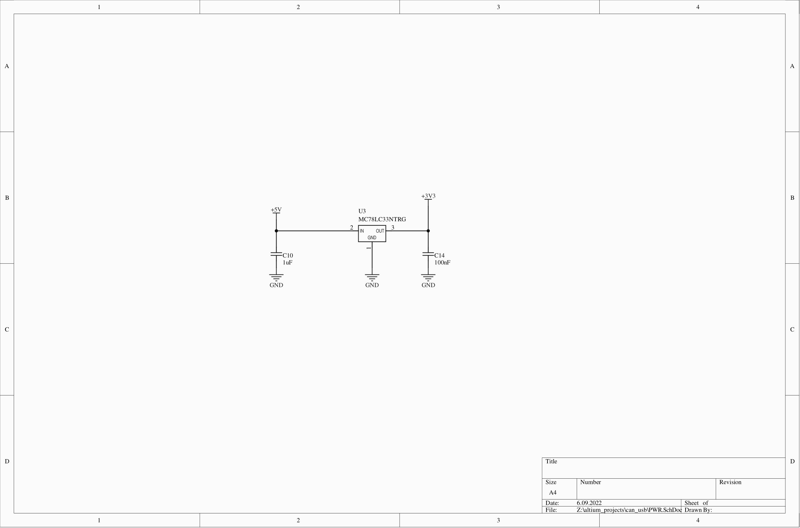
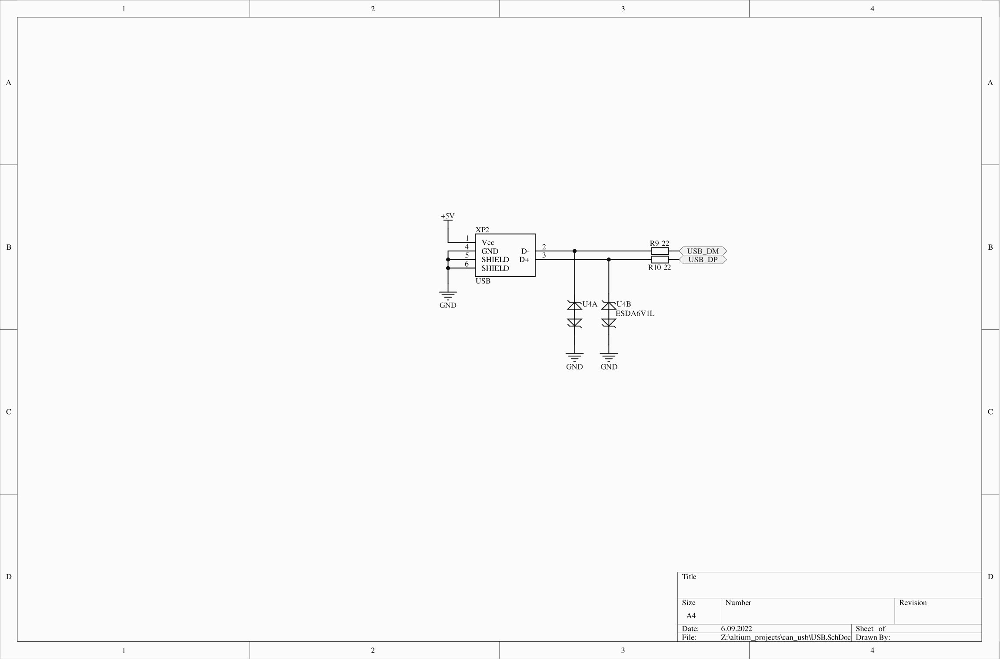
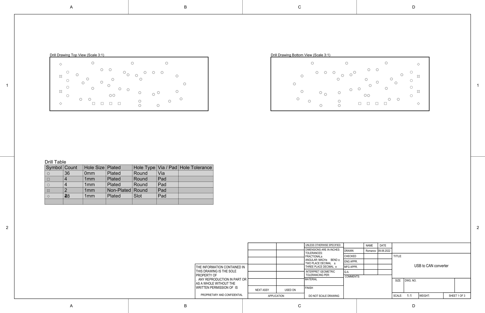
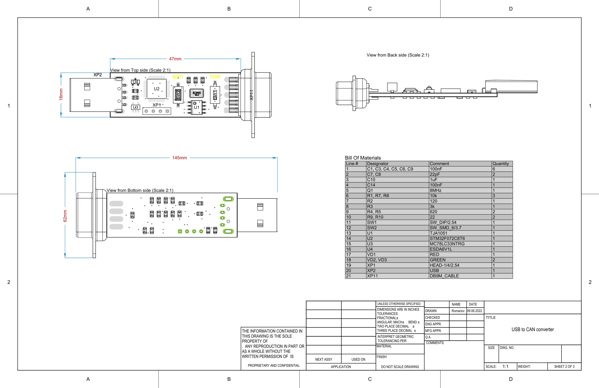
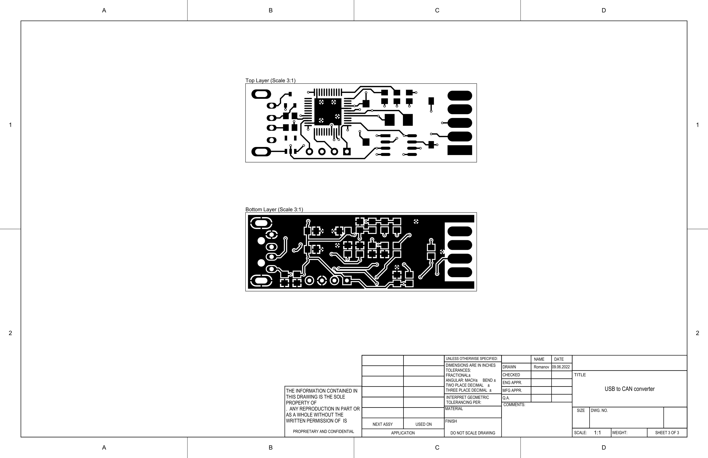
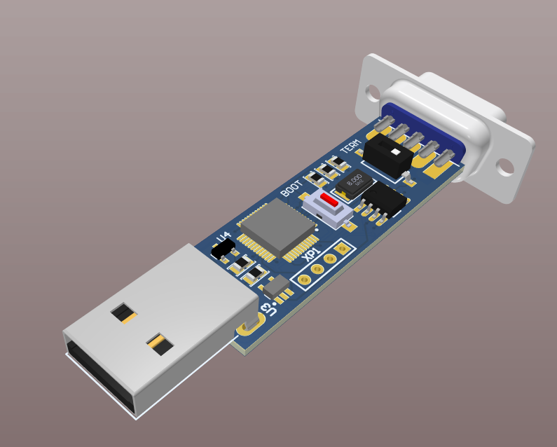
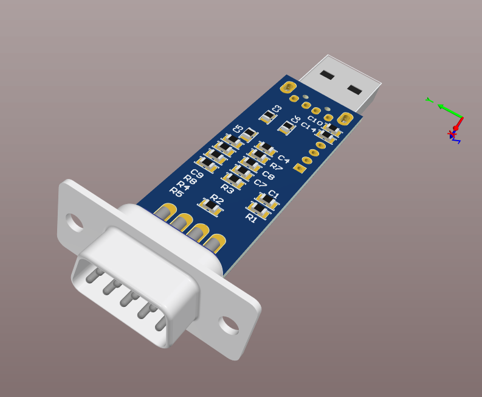

# About
A simple USB to CAN converter based on STM32F072 MCU.\
It is recomended to open the project in _Altium Designer v20.2.7_ but earlier versions can also be suitable.

_NB: Also check my repositories for USB_CAN_MICRO, the micro version of the converter which PCB can fit into a standard DB-9 connector enclosure._

# Schematics

# PCB

# Converter's variants
* USB_CAN.PcbDoc - first version
* USB_CAN_Z69.PcbDoc - second version for Z69 plastic enclosure
* USB_TypeA.PcbDoc - the final one, no enclosure

# 3D view

